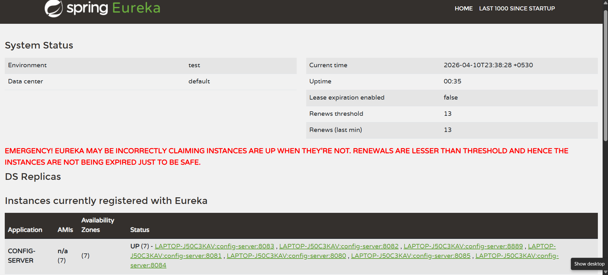

# 🌱 Automated Greenhouse Management System (AGMS)

The **AGMS** is a cloud-native, microservice-based platform designed to modernize agricultural precision. By transitioning from manual management to a digital ecosystem, the system connects to a live external provider to monitor and control greenhouse environments in real-time.

---

## 🏗️ System Architecture

The project is built on a distributed microservices architecture using **Spring Boot** and **Spring Cloud**. It utilizes a **Database-per-Service** pattern to ensure data isolation and scalability.

### Service Registry & Details

| Service | Port | Primary Responsibility |
|---|---|---|
| **Config Server** | 8889 | Centralized configuration management using a Git-backed repository. |
| **Eureka Server** | 8761 | Service registry for dynamic registration and discovery of all microservices. |
| **API Gateway** | 8080 | Single entry point for all requests, handling routing and JWT-based security. |
| **Identity Service** | 8085 | Handles user registration, authentication, and JWT issuance for the AGMS ecosystem. |
| **Zone Service** | 8081 | Manages greenhouse sections and environmental thresholds (Min/Max Temp). |
| **Telemetry Service** | 8082 | A "Data Bridge" that fetches live sensor readings every 10 seconds via Reactive WebFlux. |
| **Automation Service** | 8083 | The "Brain" or Rule Engine that triggers actions (Fans/Heaters) based on thresholds. |
| **Crop Service** | 8084 | Manages plant growth lifecycles from Seedling to Harvest. |

---

## 🔌 External IoT Integration

The system communicates with a live external hardware layer to ingest real-time environmental data.

> [!CAUTION]
> **API URL Configuration:**
> - **Legacy URL:** `http://104.211.95.241:8080/api`
> - **Current Functional URL:** `http://localhost:9090/api` *(Updated for local development and stability)*

The **Telemetry Service** acts as the fetcher, utilizing a scheduled task to pull data from the external provider and immediately push it to the **Automation Service** for decision-making.

### The Workflow

1. **The Fetcher** — A scheduled task in the Telemetry Service runs every 10 seconds to fetch the latest readings.
2. **The Pusher** — Data is immediately sent to the Automation Service via an internal POST request.
3. **Reactive Stack** — All interactions with the External IoT Service are handled using non-blocking I/O (Spring WebFlux).

---

## 🧠 Business Rules & Logic

To ensure precision and safety, the following rules are enforced at the service level:

- **Zone Validation:** When creating a zone, the system strictly validates that `minTemp < maxTemp`.
- **Rule Engine:**
    - If `currentTemp > maxTemp` → Log action `TURN_FAN_ON`
    - If `currentTemp < minTemp` → Log action `TURN_HEATER_ON`
- **Crop State Machine:** Crop batches follow a strict lifecycle: `SEEDLING` → `VEGETATIVE` → `HARVESTED`.

---

## 🛡️ Security & Authentication

Security is centralized at the **API Gateway** level.

- **JWT Validation:** The gateway intercepts all incoming requests to verify the presence of a valid Bearer Token.
- **Access Control:** Requests with missing, expired, or malformed tokens are rejected with a `401 Unauthorized` status.
- **Identity Service:** While the assignment provides external auth specifications, this project includes a dedicated Identity Service to manage internal AGMS user credentials securely.

---

## ⚙️ Configuration Management

This project uses a **Config Sub-repository** strategy.

- **`.gitmodules`:** The `config-repo` is managed as a Git submodule to keep configuration files independent from the source code.
- **Dynamic Updates:** Application properties (DB credentials, service URLs) can be updated in the sub-repo and reflected across services without a full rebuild.

---

## 🚀 Startup Instructions

To ensure proper service discovery and property fetching, start the services in the following order:

1. **Config Server** — Wait for it to initialize and connect to the Git repo.
2. **Eureka Server** — Ensure the dashboard is accessible at `http://localhost:8761`.
3. **API Gateway & Identity Service** — Establishes the security layer.
4. **Domain Services** — Start Zone, Telemetry, Automation, and Crop services.

### Eureka Dashboard Verification

Verify that all **8 instances** are registered and show a status of `UP`.



---

## 🧪 Testing with Postman

A comprehensive Postman collection is included in the root directory: `AGMS_Tests.postman_collection.json`.

### Key Workflows to Test

1. **User Registration** — Create a manager account via the Identity Service.
2. **Authentication** — Login to obtain the JWT Bearer Token.
3. **Zone Setup** — Create a zone; this triggers an external device registration.
4. **Rule Execution** — Observe the Automation Service logs to see Fan/Heater actions based on telemetry data.

### Postman Collection Setup

Copy the JSON below and save it as `AGMS_Tests.postman_collection.json` in your project's root folder.

<details>
<summary>📋 Click to expand Postman Collection JSON</summary>

```json
{
  "info": {
    "name": "AGMS_Final_Tests",
    "schema": "https://schema.getpostman.com/json/collection/v2.1.0/collection.json"
  },
  "item": [
    {
      "name": "Identity Service",
      "item": [
        {
          "name": "Register User",
          "request": {
            "method": "POST",
            "header": [],
            "body": {
              "mode": "raw",
              "raw": "{\n    \"name\": \"chamith\",\n    \"email\": \"chamith@agms.com\",\n    \"password\": \"password123\"\n}",
              "options": { "raw": { "language": "json" } }
            },
            "url": { "raw": "http://localhost:8080/auth/register" }
          }
        },
        {
          "name": "Login / Get Token",
          "request": {
            "method": "POST",
            "header": [],
            "body": {
              "mode": "raw",
              "raw": "{\n    \"username\": \"chamith\",\n    \"password\": \"password123\"\n}",
              "options": { "raw": { "language": "json" } }
            },
            "url": { "raw": "http://localhost:8080/auth/token" }
          }
        }
      ]
    },
    {
      "name": "Zone Service",
      "item": [
        {
          "name": "Create Zone",
          "request": {
            "method": "POST",
            "header": [
              { "key": "Authorization", "value": "Bearer {{token}}", "type": "text" }
            ],
            "body": {
              "mode": "raw",
              "raw": "{\n    \"name\": \"Tomato-Zone-01\",\n    \"minTemp\": 20.0,\n    \"maxTemp\": 30.0\n}",
              "options": { "raw": { "language": "json" } }
            },
            "url": { "raw": "http://localhost:8080/api/zones" }
          }
        }
      ]
    },
    {
      "name": "Automation Service",
      "item": [
        {
          "name": "Get Automation Logs",
          "request": {
            "method": "GET",
            "header": [
              { "key": "Authorization", "value": "Bearer {{token}}", "type": "text" }
            ],
            "url": { "raw": "http://localhost:8080/api/automation/logs" }
          }
        }
      ]
    }
  ]
}
```

</details>